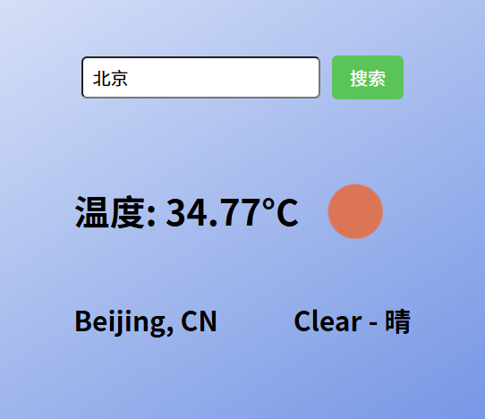

# 集成地名查询天气前端页面

## 相关功能代码在componends文件夹WeatherSearch.vue中

## 目前功能

实现了搜索框的功能

目前通过geocode和weather两个api实现了查询功能。先通过geocode查询到经纬度，再通过weather查询到天气信息。

应用了异步查询功能，实现了输入框的实时查询，并将查询结果展示在下拉框中。

api_key等相关信息已存放在config文件夹中，并且gitignore，防止泄露。

apiconfig.js格式如下：
```
export default{
    API_KEY: '你的API_KEY',
    GEO_API_URL:'你的GEO_API_URL',
    WEATHER_API_URL:'你的WEATHER_API_URL'
};
```

## 效果图
